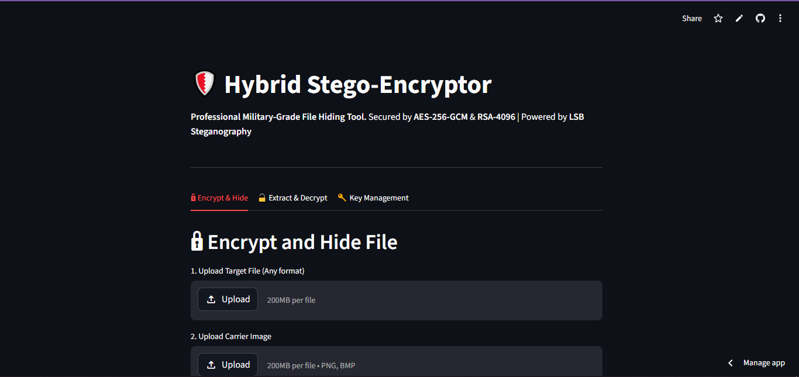
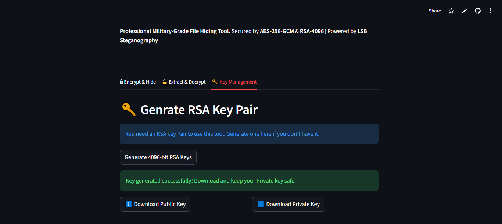
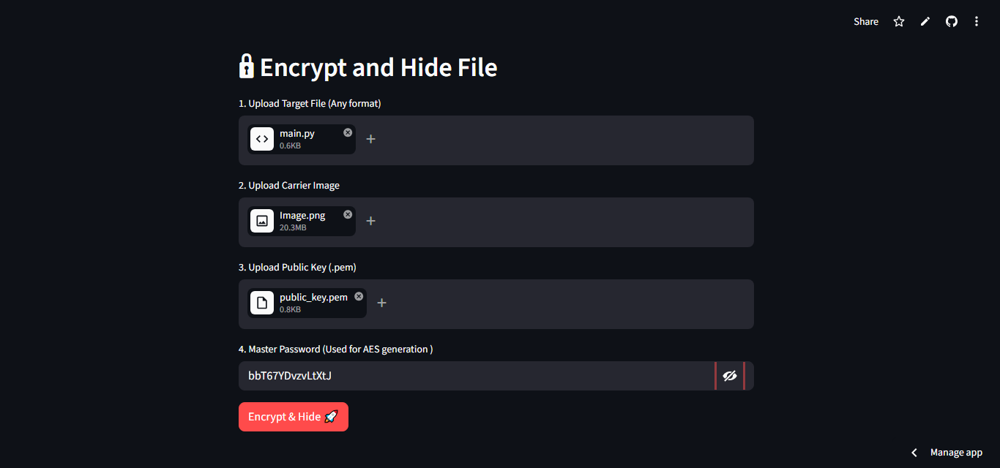
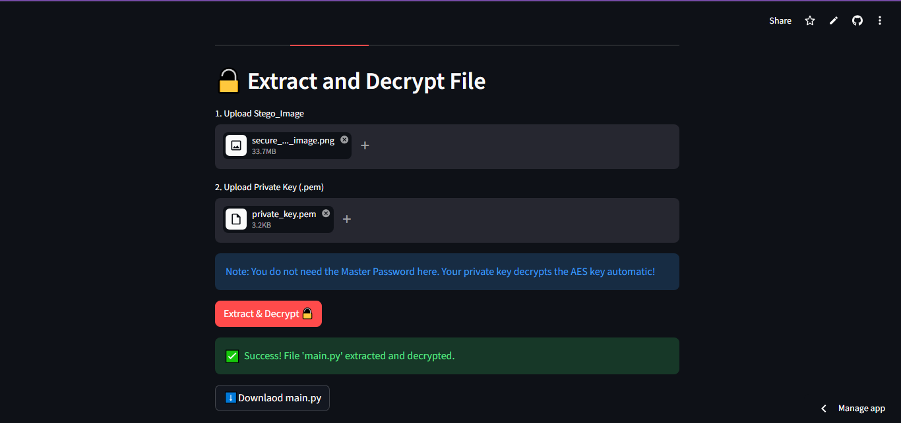

#Hybrid Stego-Encryptor

I build this project to solve a very specific problem: how do you send a highly sensitive file without anyone even a file is being transmitting!!

To any one looking at the output, its just a normal 'PNG' picure. to you its a secret valut.

How it works!

1.Hybrid Encryption: it uses AES-256-GCM to encrypt the actual file quickly and secure. Then it uses RSA-4096 to encrypt the AES key
2.LSB Steganography: the encrypted payload is injected into the least Significant Bits of a carrier Image
3.Smart Session State:Built a clean Ui using Streamlit that remembers keys during the session so prevent the dreaded 'refresh data loss' Ux problem.

Screenshots:

Quick Start:

1.clone the repo!

2.Install dependencies:
pip install -r requirements.txt

3.Run the app:
python -m streamlit run app/main.py

Built from screatch to learn cryptogtaphy and clean architechrure. if you find a bug or have a cool fearure feel fre to open an issue or fork!